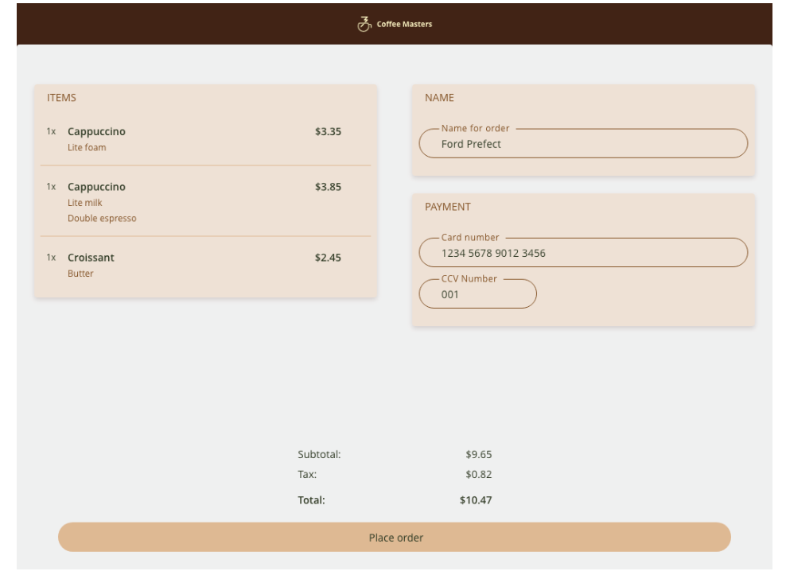
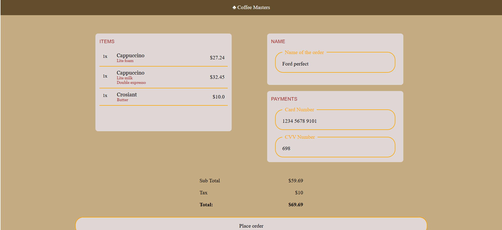

I have created a This Checkout page for this coffee app.
We can also make the name and payment fields as input fields.
Learned a bit of flex, box containers, overlayered fields, shadow things and slight idea of where not to use grid.
Followed the Frontend Masters course and the website link is:
[Link reference](https://btholt.github.io/complete-intro-to-web-dev-v3/lessons/css/project)  
The Reference Image:

Implemented Image:
